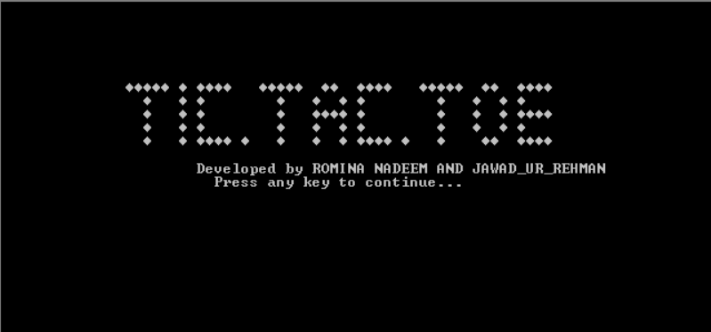
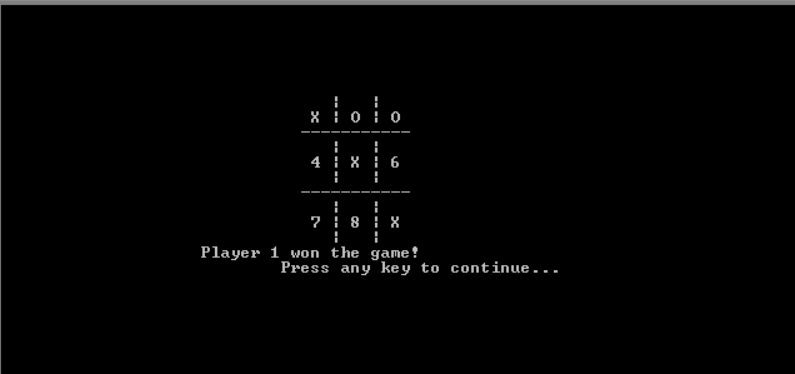
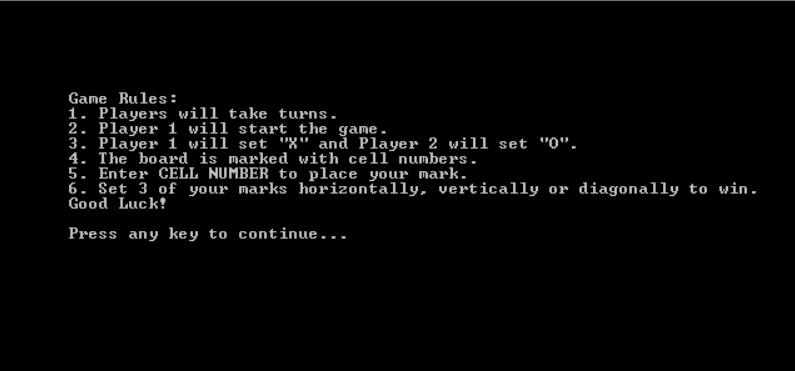

# 🎮 Tic-Tac-Toe (x86 Assembly)

This project is a classic **Tic-Tac-Toe** game implemented using **x86 Assembly Language**. It runs in a terminal interface and is designed to help explore the low-level workings of game logic and I/O at the hardware-near level.

## 📌 Features

- 🧠 Two-player turn-based gameplay
- 🕹️ CLI interface for move selection
- 🏆 Win and draw condition detection
- 📦 Compact and optimized code structure
- 💻 Written in pure Assembly (MASM/TASM compatible)

## 🛠 Technology Stack

- **Language**: x86 Assembly
- **Assembler**: MASM / TASM / NASM (depending on setup)
- **Environment**: DOSBox (recommended) or any compatible x86 emulator

## 🚀 How to Run

1. Clone the repository:
   ```bash
   git clone https://github.com/jawadurrehrman48/Tic-Tac-Toe-.git
   cd Tic-Tac-Toe-
2. Open mycode.asm in your assembler environment:
3. Assemble and link the code:
   ```bash
   tasm mycode.asm
   tlink mycode.obj
4. Run the executable using:
   ```bash
   mycode.exe
.

## 📸 Screenshots

### 🧩 Game Preview


### 🎮 Gameplay in Action


### 🏁 Win Condition


<p align="center">
  
  
  
</p>


   


 

